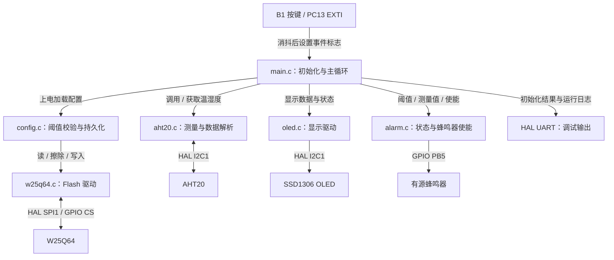
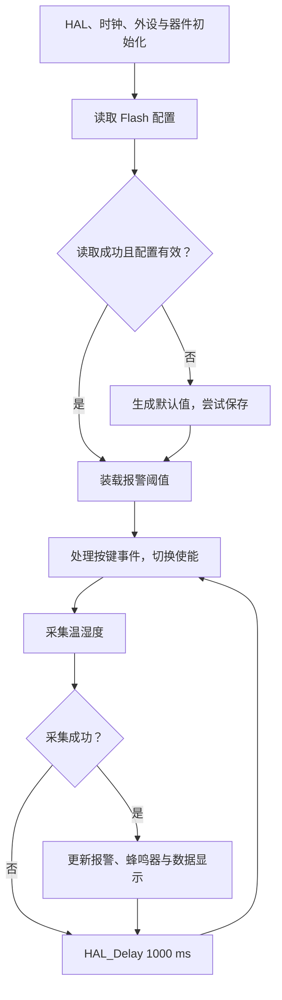

# STM32F401RE 环境监测与报警终端

**STM32F401RE Environment Monitoring and Alarm Terminal**

基于 STM32F401RE 的嵌入式项目：通过 AHT20 获取温湿度，使用 SSD1306 OLED 和 UART 输出运行状态，将报警阈值保存到 W25Q64 SPI Flash，并通过报警状态与按键控制有源蜂鸣器。

项目重点是完成从**外设通信 → 数据解析 → 配置持久化 → 状态判断 → 人机交互 → 故障定位**的工程实践，并逐步从裸机主循环过渡到 FreeRTOS 任务调度。

`STM32F401RE` · `Cortex-M4` · `C` · `HAL` · `STM32CubeIDE` · `I2C` · `SPI` · `UART` · `EXTI`

## 实现状态

| 范围 | 当前进展 |
| --- | --- |
| 本仓库裸机工程 | 已实现温湿度采集、OLED 显示、UART 输出、Flash 阈值保存/加载、报警状态与按键控制 |
| 滞回报警 | 已有触发/恢复双阈值及模块接口；当前恢复分支存在缺陷，详见“关键技术点” |
| FreeRTOS 迁移准备 | 独立本地工程 `freertos_lab01` 已创建 LED / UART 两个任务并使用 `osDelay`；尚未并入本仓库环境监测业务 |
| Queue 任务间通信 | 后续计划，当前应用未实现 |

本文状态依据 2026-10-03 的源码核查；FreeRTOS 实验源码暂未收录于本仓库。当前克隆仓库得到的仍是裸机工程。

## 工程能力与设计取舍

- **从通信到业务分层：** AHT20、OLED、W25Q64 封装设备操作，Config 管理参数，Alarm 管理状态；主程序通过接口组织业务，减少外设协议与报警逻辑的相互依赖。
- **配置持久化闭环：** 上电加载外部 Flash 参数，检查阈值关系及范围，异常时使用默认值并尝试写回，建立启动恢复路径。
- **中断与主循环协作：** EXTI 回调完成时间间隔消抖与事件标记，主循环处理蜂鸣器使能切换，避免在按键中断中执行完整业务流程。
- **有证据的故障定位：** 针对 W25Q64 JEDEC ID 随机异常，按 SPI 配置、CS 时序、GPIO、供电、接线逐层排查，最终定位杜邦线接触问题。
- **循序迁移 RTOS：** 先在独立实验中理解任务创建、优先级和阻塞，再规划传感器数据通过 Queue 传递，保持当前环境监测工程可维护。

## 项目架构

下图表示本仓库当前裸机架构；箭头分别标明调用、数据或外设接口关系。



AHT20 与 OLED 共用 I2C1；裸机版本在主循环中顺序访问。后续多任务访问同一总线时，需要明确总线所有权或增加互斥保护。

## 软件流程

下图概括当前 `main.c` 的执行顺序。仅在有按键事件时切换使能；采集成功后调用 `Alarm_Update()`、更新蜂鸣器及 UART 输出，并在 OLED 初始化成功时刷新显示。报警恢复分支的限制见后文。



EXTI 回调以 50 ms 间隔过滤按键事件，再设置 `button_pressed`。事件由主循环处理，响应速度受采集、显示、串口输出和主循环延时共同影响。

## 硬件连接

主控：**NUCLEO-F401RE / STM32F401RE，ARM Cortex-M4**。下表对应本仓库 `.ioc`、GPIO 定义及 MSP 初始化代码。

| 外设 / 信号 | STM32 引脚 | 配置与说明 |
| --- | --- | --- |
| AHT20 SCL / SDA | PB8 / PB9 | I2C1，100 kHz，7-bit 地址 `0x38` |
| SSD1306 SCL / SDA | PB8 / PB9 | 与 AHT20 共用 I2C1，7-bit 地址 `0x3C` |
| W25Q64 CLK / SCK | PA5 | SPI1 SCK |
| W25Q64 DO / MISO | PA6 | SPI1 MISO |
| W25Q64 DI / MOSI | PA7 | SPI1 MOSI |
| W25Q64 CS | PB6 | 软件片选，空闲为高电平 |
| 有源蜂鸣器模块控制端 | PB5 | 低电平触发，初始化为高电平 |
| 板载 B1 按键 | PC13 | 下降沿 EXTI |
| USART2 TX / RX | PA2 / PA3 | ST-LINK Virtual COM Port，115200 / 8N1，无流控 |
| AHT20 / OLED / W25Q64 电源 | 3.3 V / GND | 按当前模块接法供电，所有模块共地 |

SPI1 配置：Master、2 Lines、8-bit、MSB First、CPOL Low、CPHA 1 Edge、Software NSS、64 分频。当前蜂鸣器按“低电平触发模块”接控制信号；其电源接法以实际模块额定参数为准。

## 软件目录与模块职责

保留 STM32CubeIDE 工程名 `gpio_led01` 和现有目录，源码未为展示而搬迁。

```text
stm32-environment-monitor/
├── README.md
├── Core/
│   ├── Inc/                 # 头文件与 HAL 配置
│   ├── Src/                 # main、AHT20、OLED、W25Q64、Config
│   └── Startup/             # Cortex-M4 启动文件
├── Application/             # alarm.c / alarm.h
├── Drivers/                 # CMSIS、STM32 HAL 与原许可证
├── Images/                  # 图片目录说明，待补充实物资料
├── .project / .cproject     # CubeIDE 工程配置
├── .settings/
├── gpio_led01.ioc           # CubeMX 配置
├── STM32F401RETX_FLASH.ld
├── STM32F401RETX_RAM.ld
└── .gitignore
```

| 模块 | 主要接口 / 职责 |
| --- | --- |
| [aht20.c](Core/Src/aht20.c) / [aht20.h](Core/Inc/aht20.h) | `AHT20_Init`、`AHT20_Read`：设备应答检查、测量命令、原始数据解析 |
| [oled.c](Core/Src/oled.c) / [oled.h](Core/Inc/oled.h) | 初始化、页清除、字符与字符串显示 |
| [w25q64.c](Core/Src/w25q64.c) / [w25q64.h](Core/Inc/w25q64.h) | JEDEC ID、状态读取、Sector Erase、Page Program、Data Read |
| [config.c](Core/Src/config.c) / [config.h](Core/Inc/config.h) | `Config_Load`、`Config_Save`、`Config_IsValid`、`Config_SetDefault` |
| [alarm.c](Application/alarm.c) / [alarm.h](Application/alarm.h) | 阈值、状态、使能标志及低电平蜂鸣器控制 |
| [main.c](Core/Src/main.c) | 外设初始化、配置装载、采集与输出调度、EXTI 回调 |

## 关键技术点

### I2C 通信：从原始字节到环境数据

AHT20 和 SSD1306 通过不同地址共用 I2C1。调用 HAL 接口时，代码将 7-bit 地址左移一位。AHT20 驱动发送测量命令后等待 80 ms，读取 6 字节并检查 Busy 位，再拼接 20-bit 原始数据换算温湿度；通信错误通过 `HAL_StatusTypeDef` 返回给上层。

这部分体现总线共享、设备寻址、位运算与状态返回的分工。当前采集使用阻塞等待，尚未实现异步驱动或 CRC 校验。

### SPI Flash：擦写流程与配置恢复

W25Q64 驱动以软件 CS 控制一次命令事务，实现 JEDEC ID `0x9F`、Write Enable `0x06`、状态读取 `0x05`、Sector Erase `0x20`、Page Program `0x02` 和 Data Read `0x03`。

保存配置时执行“写使能 → 扇区擦除 → 等待 BUSY 清除 → 写使能 → 页编程 → 等待完成”。页编程接口限制单次最多 256 字节，并拒绝跨页写入。Config 将四个阈值保存到 `0x002000`，上电读取并检查阈值关系与上限。

“配置不存在”在当前实现中不是文件系统判定：未写入的数据会在阈值校验时被拒绝，随后使用默认值并尝试保存。当前 `main.c` 未检查该保存调用的返回值，所以恢复提示不能单独证明写入成功；再次上电读回才是持久化验证的一环。当前仅保存配置，未实现连续环境数据日志、磨损均衡或断电写入保护。

### UART 调试：观察初始化与运行状态

USART2 以 115200 / 8N1 输出外设初始化结果、JEDEC ID、Flash 配置来源、温湿度和报警状态，帮助区分通信问题、配置问题和业务状态问题。日志使用 `snprintf` 组织，再由 `HAL_UART_Transmit` 发送；当前是阻塞发送，尚未实现 DMA 日志队列或串口命令解析。

### 滞回报警：设计目标与当前边界

采用分开的触发阈值与恢复阈值，目标是在阈值附近波动时保持原状态，减少报警反复切换。

| 参数 | 触发阈值 | 恢复阈值 |
| --- | --- | --- |
| 温度 | 30.0 °C | 29.0 °C |
| 湿度 | 90.0 %RH | 85.0 %RH |

预期规则为：正常态中，任一测量值达到触发阈值则报警；报警态中，两项均降至各自恢复阈值才解除；其他情况下保持状态。内部以 ×10 整数表达阈值和测量值，便于业务比较。

**当前缺陷：** `Alarm_Update()` 的恢复分支实际使用“温度和湿度均达到触发阈值”，尚未使用恢复阈值。因此双阈值接口已存在，但滞回行为尚未正确完成。本次只更新文档，保留代码现状；恢复条件修复与边界测试列为优先后续工作。

### 模块化设计：职责与内部状态隔离

外设模块持有各自 HAL 句柄，通过公开函数提供设备操作；Config 隔离 Flash 地址和配置存储格式；Alarm 使用 `static` 保存内部状态与使能标志。`main.c` 负责调度，不直接维护 Alarm 内部变量。这种划分有助于逐个调试外设，也为后续调整任务边界提供基础。

### FreeRTOS 任务调度：独立实验进展

本地 `freertos_lab01` 使用 **FreeRTOS + CMSIS-RTOS2**，在 `main.c` 中通过 `osKernelInitialize`、`osThreadNew`、`osKernelStart` 初始化并启动调度。

| 任务角色 | 实际任务 / 入口 | 工作内容 | 阻塞调用 |
| --- | --- | --- | --- |
| LED Task | `defaultTask` / `StartDefaultTask` | 翻转 LED GPIO | `osDelay(500)` |
| UART Task | `UartTask` / `StartUartTask` | 发送串口消息 | `osDelay(1000)` |

两个任务均配置为 `osPriorityNormal`，实验启用抢占式调度。两个任务均配置为 `osPriorityNormal`，实验启用抢占式调度。`osDelay` 的参数单位为内核 tick。实验配置 `configTICK_RATE_HZ = 1000`，因此上述等待约为 500 ms 和 1000 ms；任务进入 Blocked 状态后，调度器可运行其他 Ready 任务，等待到期后仍需按调度规则获得 CPU。任务执行本身也耗时，因此“相对延时 + 工作”的循环不等于严格定周期任务。详见 [CMSIS-RTOS2 等待函数说明](https://arm-software.github.io/CMSIS_6/main/RTOS2/group__CMSIS__RTOS__Wait.html)。

这一步用于理解阻塞与调度。本仓库传感器、显示、报警和 Flash 操作仍由裸机主循环组织；Queue 通信及共享外设访问保护尚待实现。

## 调试经历：W25Q64 JEDEC ID 随机异常

同一套代码在不同复位过程中出现过以下结果：

```text
EF 40 17    正常结果
FF FF FF   异常结果
00 00 00   异常结果
```

排查顺序：

1. **SPI 配置：** 核查 Master 模式、CPOL / CPHA、位宽、位序和软件 NSS。
2. **CS 时序：** 检查片选拉低、发送读取命令、接收数据、释放片选的完整事务。
3. **GPIO：** 核查 PA5 / PA6 / PA7 复用和 PB6 输出配置。
4. **供电：** 检查电源和 GND 共地。
5. **接线：** 检查 SPI 线路与杜邦线接触情况，替换可疑连接线。

**最终定位为杜邦线接触问题。** 更换 SPI 使用的杜邦线后，多次复位均稳定读取到 `EF 40 17`。这段经历体现了从软件、协议和时序推进到物理连接的排查方法。

本段保留原项目调试记录；本次 README 更新未重复实机测试。

## 构建、运行与验证

1. 克隆仓库，在 STM32CubeIDE 选择 **File → Import → General → Existing Projects into Workspace**，导入仓库根目录。
2. 工程名保持 `gpio_led01`；工作空间已有同名工程时，使用新的工作空间。
3. 选择 **Debug** 构建配置，执行 **Project → Build Project**，再通过 ST-LINK 下载。
4. 按硬件表连接外设，串口终端选择 ST-LINK 对应端口，设置 `115200 / 8N1`。

串口输出格式示例（非本次实机日志）：

```text
AHT20 Init: OK
OLED Init: OK
W25Q64 JEDEC ID: EF 40 17
Load Config: T_ON=300 T_OFF=290 H_ON=900 H_OFF=850
Config source: FLASH
Temperature: 26.3 C, Humidity: 71.0 %, State: NORMAL
```

| 验证项 | 证据与范围 |
| --- | --- |
| 裸机工程构建 | 2026-09-27 使用 STM32CubeIDE 2.2.0 在独立工作空间完成干净构建：0 errors / 0 warnings；本次仅改 README，复用该构建记录 |
| Flash 通信故障定位 | 原项目记录：更换杜邦线后，多次复位读取 ID 稳定 |
| 本次文档更新 | 对照源码检查接口、引脚、流程和实现边界；不作为本次硬件功能测试证明 |
| 待验证行为 | 修复后的滞回边界、Flash 写入失败处理、掉电重启读回及 RTOS 业务集成 |

## 后续计划

- **先修正报警行为：** 修复恢复条件，覆盖触发点、恢复点、滞回区间和温湿度组合的边界测试。
- **推进 FreeRTOS 迁移：** 在 LED / UART 实验基础上拆分采集、显示和报警任务，明确每个外设的访问责任。
- **引入 Queue：** 由采集任务发送温湿度快照，业务任务接收处理；同步明确队列满、超时及共享总线保护策略。
- **增强配置可靠性：** 检查保存返回值，增加版本标记、完整性校验、BUSY 等待超时与断电恢复策略。
- **补齐演示证据：** 增加真实接线照片、OLED 显示、串口日志和状态边界测试记录。
